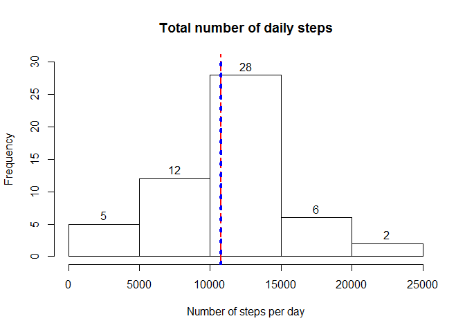
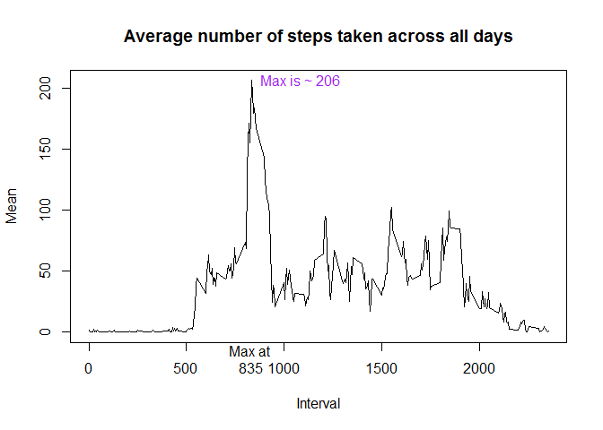
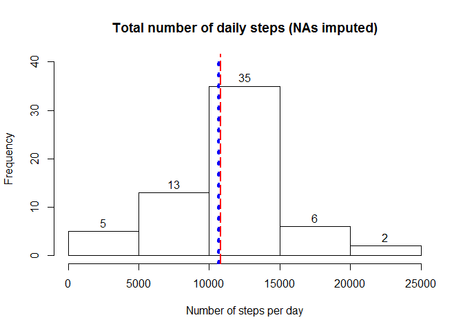
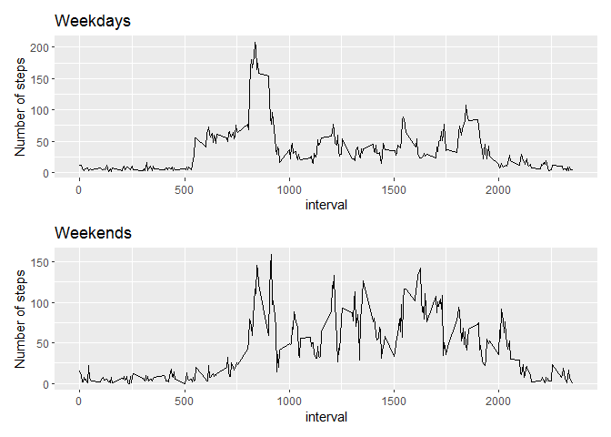

# Libaries used
- dplyr
- patchwork
- ggplot2

## Loading and preprocessing the data

```r
data <- read.csv("activity.csv")
head(data);
```

```
##   steps       date interval
## 1    NA 2012-10-01        0
## 2    NA 2012-10-01        5
## 3    NA 2012-10-01       10
## 4    NA 2012-10-01       15
## 5    NA 2012-10-01       20
## 6    NA 2012-10-01       25
```

```r
dim <- dim(data)
summary(data)
```

```
##      steps                date          interval     
##  Min.   :  0.00   2012-10-01:  288   Min.   :   0.0  
##  1st Qu.:  0.00   2012-10-02:  288   1st Qu.: 588.8  
##  Median :  0.00   2012-10-03:  288   Median :1177.5  
##  Mean   : 37.38   2012-10-04:  288   Mean   :1177.5  
##  3rd Qu.: 12.00   2012-10-05:  288   3rd Qu.:1766.2  
##  Max.   :806.00   2012-10-06:  288   Max.   :2355.0  
##  NA's   :2304     (Other)   :15840
```
First few rows of data and descriptive summary of its variables shown above. There are 17568 records in the dataset.

## What is mean total number of steps taken per day?

```r
total_steps_day <- with(data, aggregate(steps ~ date,FUN=sum))
mean_total_steps <- round(mean(total_steps_day$steps))
median_total_steps <- round(median(total_steps_day$steps))

hist(total_steps_day$steps,labels=TRUE,ylim=c(0,30),main="Total number of daily steps",xlab="Number of steps per day")
abline(v=mean_total_steps,col='red',lty=5,lwd=2)
abline(v=median_total_steps,col='blue',lty=3,lwd=4)
```

<!-- -->

Mean (red dashed line) of the total number of daily steps was 10766.
Median (blue dotted line) of the total number of daily steps was 10765.

## What is the average daily activity pattern?

```r
steps_per_timepoint <- with(data, aggregate(steps ~ interval,FUN=mean))

plot(x=steps_per_timepoint$interval,y=steps_per_timepoint$steps,type='l',ylab="Mean",
     main="Average number of steps taken across all days",xlab="Interval")

# Interval with highest average of steps
max_steps <- max(steps_per_timepoint$steps)
interval_max <- steps_per_timepoint$interval[which(steps_per_timepoint$steps==max_steps)]

axislabel <- paste0("Max at \n",interval_max)
max_avg_steps <- paste0("Max is ~ ",round(max_steps))
axis(side=1,at=c(interval_max),labels=axislabel,tick=FALSE)
text(x=interval_max,y=max_steps,col="purple",labels=max_avg_steps,pos=4)
```

<!-- -->

The 5-minute interval at 835 contains the maximum number of 206.17 steps taken, averaged across all days.

## Imputing missing values

```r
miss_vec <- is.na(data$steps)
missings <- sum(miss_vec)
```
There are in total 2304 missing records in the dataset.

Strategy to replace NAs: sample randomly from all non-NA 5min-interval averages 

```r
library(dplyr)
```

```
## 
## Attaching package: 'dplyr'
```

```
## The following objects are masked from 'package:stats':
## 
##     filter, lag
```

```
## The following objects are masked from 'package:base':
## 
##     intersect, setdiff, setequal, union
```

```r
set.seed(19)
# Generate vector with randomly sampled number of steps averages with same length as raw data has rows
samplev <- sample(x=steps_per_timepoint$steps[!is.na(steps_per_timepoint$steps)],size=dim(data)[1],replace=TRUE)

# Join sampled averages on data
data_sample <- cbind(data,samplev)
# replace each NA with respective random step count
data_imputed <- data_sample %>% mutate(steps = ifelse(is.na(steps),samplev,steps))
```

Reproduce the histogram and averages:

```r
total_steps_day <- with(data_imputed, aggregate(steps ~ date,FUN=sum))
mean_total_steps <- round(mean(total_steps_day$steps))
median_total_steps <- round(median(total_steps_day$steps))

hist(total_steps_day$steps,labels=TRUE,ylim=c(0,40),main="Total number of daily steps (NAs imputed)",
     xlab="Number of steps per day")
abline(v=mean_total_steps,col='red',lty=5,lwd=2)
abline(v=median_total_steps,col='blue',lty=3,lwd=4)
```

<!-- -->

Mean (red dashed line) of the total number of daily steps was 10787.
Median (blue dotted line) of the total number of daily steps was 10645.

The values differ from the non-imputed raw data.
First of all, mean and median deviate more from each other now than in original data. 
Secondly, compared to the previous statistics, the mean only slightly increased while the median decreased by ca. 1%.
This is because the random imputation at intervals with missing step count is using many 0es since they make up more than half of all step counts.

## Are there differences in activity patterns between weekdays and weekends?
Wasn't able to set language to English, therefore the R output produced German weekday names.
So this bit will need to be updated depending on your language setting. 
Please replace "Samstag","Sonntag" with "Sunday" , "Saturday" below.

```r
# Create Weekday factor variable 
data_imputed <- data_imputed %>% mutate(wkd = ifelse(weekdays(as.POSIXct(date)) %in% c("Samstag","Sonntag"),"Weekend","Weekday"))
data_imputed$wkd <- factor(data_imputed$wkd)
steps_per_interval <- with(data_imputed, aggregate(steps ~ wkd+interval,FUN=mean))
data_weekday <- subset(steps_per_interval,wkd=="Weekday")
data_weekend <- subset(steps_per_interval,wkd=="Weekend")
```


```r
#install.packages("patchwork")
library(patchwork)
library(ggplot2)

g1 <- ggplot(data=data_weekday) + 
  geom_line(aes(x=interval,y=steps)) +
  labs(title="Weekdays",y="Number of steps")
g2 <- ggplot(data=data_weekend) + 
  geom_line(aes(x=interval,y=steps)) +
  labs(title="Weekends",y="Number of steps")
g1 + g2 + plot_layout(ncol = 1)
```

<!-- -->


